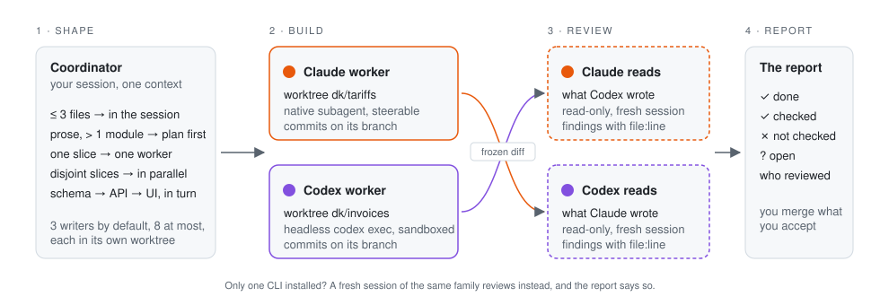

<div align="center">

<picture>
  <source media="(prefers-color-scheme: dark)" srcset="assets/logo-dark.png">
  
</picture>

# delegate-kit

**Claude writes it. Codex reads it. Or the other way round.**<br>
One session, the subscriptions you already have, no API keys.

[](https://github.com/tomastaker/delegate-kit/actions/workflows/ci.yml)
[](LICENSE)
[](https://claude.com/claude-code)
[](https://github.com/openai/codex)
[](https://github.com/pingdotgg/t3code)

</div>

---

Your coding session becomes an overseer with two gangs, one from Anthropic and one from OpenAI. He keeps two rules. No gang inspects its own stones. And nobody gets the whip for a one-line fix.

In practice that means three things. Small work stays in the session. Big work goes to a fresh worker in its own git worktree, native when it is the same model family as your session, headless `claude -p` or `codex exec` when it is the other one. Before you merge, the family that did not write the diff reads it and reports what it found.

## Why

Models already delegate. They do it inconsistently. A one-line fix spawns a worker, a ten-module feature starts with no plan, three subagents write into one working tree, and the author approves its own diff. delegate-kit fixes the decision, not the model:

| Without | With |
|---|---|
| Delegation on a whim | A shape picked from numbers before any work starts |
| Claude reviews Claude | The other family reviews, when its CLI is installed. Otherwise a fresh session, labelled as such |
| Workers collide in your tree | One writer per git worktree, locked. You merge what you accept |
| "Done." | `done`, `checks_run`, `not_verified`, `findings`, `questions`, and who reviewed |

## How it works

<picture>
  <source media="(prefers-color-scheme: dark)" srcset="assets/pipeline-dark.svg">
  
</picture>

**1. Shape.** The coordinator names the shape first and says which one it picked.

| Shape | When | Who |
|---|---|---|
| DIRECT | up to ~3 files with clear requirements, explanations, micro-fixes, anything destructive or production-adjacent | the session itself |
| SCOUT | the hard part is finding: a large repo, several plausible causes, docs to quote | one read-only worker, then decide again |
| PLAN | prose requirements, ambiguity, more than one module or ~10 files, any question that ends in a verdict | planner, read-only, strongest model |
| SINGLE | one vertical slice too big for DIRECT | one implementer in its own worktree |
| PARALLEL | two or more slices with disjoint write scopes and stable interfaces | one implementer per slice, each in a worktree |
| SEQUENTIAL | one result changes the next task's assumptions, schema then API then UI | one worker at a time, resumed |

Worker count equals the number of independent outcomes. Coupled edits stay in one pair of hands.

**2. Build.** Every writer gets a git worktree and a lock. Three writers run at once by default, eight at most. Past three the coordinator states how the work is partitioned and waits for your yes. A worker never starts workers. When a subscription hits its limit mid-run, the writer is retried once on the other family with a note about the commits it already made.

**3. Review.** Any delegated change, any risk zone (auth, payments, migrations, production config), and any diff of the coordinator's own over ~50 lines gets a reviewer. The reviewer is a fresh read-only session with the frozen diff and the spec. It is the other family whenever that CLI is installed. When it is not, a fresh session of the same family runs and the report says `independent: false`. One reviewer is the default. A panel of two or a led review of three is proposed with the diff size and runs on your yes. Findings go to a fix worker: the implementer resumed while it is still short, otherwise a fresh one with the diff and the findings. The re-review resumes the same reviewer with the diff of the fixes. A dispute is settled by a test or a grep first, by a verifier only after that.

**4. Report.** Every worker returns one JSON object. The coordinator's report is built from it. A check that did not run is listed as not run. A worker's "done" is evidence to inspect, not a verdict.

## Example

```
you     add per-key rate limiting to the public API, rules in docs/rate-limits.md
shape   PLAN: prose rules, 2 packages, 9 files
spec    .scratch/rate-limit/spec.md, 6 lines, you said yes
plan    planner returns 3 steps and 1 blocking question; you answer it
build   Codex implements in worktree dk/rate-limit, tests pass, commits
review  Claude reads the diff: 1 high (Retry-After computed from the whole window), 1 low
fix     the same Codex session fixes both, tests re-run
re-review  the same Claude reviewer, resumed, confirms both fixes
report  done · checked: pnpm test, tsc · not checked: load test · reviewed by Claude, single
```

Your working tree was never touched. You merge the branch when you agree with the report. When Claude implements, Codex reviews. When you wrote the diff yourself in the session, it is marked `self` and still goes to the other family.

## Install

Native workers need only your host. Workers from the other family need that CLI installed and logged in, plus `bash`, `git`, `jq` and `node` 20 or newer.

```bash
npx skills add tomastaker/delegate-kit
```

or by hand:

```bash
git clone https://github.com/tomastaker/delegate-kit ~/dev/delegate-kit
ln -s ~/dev/delegate-kit/skills/delegate-kit ~/.agents/skills/delegate-kit
ln -s ../../.agents/skills/delegate-kit ~/.claude/skills/delegate-kit     # Claude Code
ln -s ../../.agents/skills/delegate-kit ~/.codex/skills/delegate-kit      # Codex CLI
```

Then the native role definitions and the safety hook. The installer backs up your settings and shows the diff first:

```bash
~/.agents/skills/delegate-kit/hooks/install.sh --dry-run
~/.agents/skills/delegate-kit/hooks/install.sh          # --claude / --codex / --hooks-only / --agents-only
```

Optional, to drive the scripts yourself:

```bash
echo 'export PATH="$HOME/.agents/skills/delegate-kit/scripts:$PATH"' >> ~/.zshrc
```

Restart running `claude` and `codex` sessions. `git pull` updates the skill through the symlinks. Re-run `install.sh` after a change to the roles.

Claude Code and Codex CLI work as coordinator and as worker. [T3 Code](https://github.com/pingdotgg/t3code) works as coordinator over either CLI.

To have every non-trivial task triaged, add one line to your global instructions:

```text
Before repository work described in prose or spanning several modules, apply delegate-kit; a DIRECT verdict needs no announcement.
```

Uninstall with `hooks/uninstall.sh`, remove the three symlinks, and `rm -rf ~/.delegate-kit` if you do not want to keep the ledger and run logs.

## Usage

Work as usual. The skill triggers on "delegate", "subagent", "scout", "plan this", "review this", "second opinion", on a feature described in prose, and on "which should we adopt". A few phrases change its defaults:

| You say | Effect |
|---|---|
| "let Codex implement", "main model Claude" | preset for this task: planner, implementer and researcher move to that family. The reviewer still follows the author |
| "plan with Fable", "review with Sol" | one model for one role |
| "panel", "two reviewers", "led" | your yes to a deeper review, given in advance |
| "this is mechanical", "a refactor", "UI work" | review depth `single`; lenses `correctness` and `standards`; implementer on Claude |

It decides alone: the shape, the family and model per role, native or external, the reviewer, review depth, one cross-vendor retry on a rate limit.

It stops and asks: before a panel, before a fourth writer, when a worker returns `blocked` with questions, when your working tree is dirty and the task touches it, before any command the safety gate classes as dangerous.

If you write a spec first, save it as `.scratch/<task>/spec.md`. Workers and the reviewer read that file.

## Commands

Two scripts. `--help` on either is the flag reference.

| Command | Does |
|---|---|
| `agent-run route --role <role>` | who runs this role, on which family, natively or externally |
| `agent-run route --role reviewer --diff FILE --author-backend claude\|codex\|self` | depth, lenses and family for a review |
| `agent-run run --role <role> --brief FILE [--backend B] [--cwd WORKTREE] [--detach]` | start a worker |
| `agent-run resume <id> --prompt TEXT` | continue a worker with its context |
| `agent-run list \| status <id> \| wait <id> \| kill <id> \| log <id>` | the ledger |
| `agent-run inspect [WORKTREE]` | what a stopped writer left behind |
| `agent-run preset [auto\|main-claude\|main-codex]` | which family carries the heavy roles |
| `agent-wt create \| diff \| lock \| release \| remove <task>` | a writer's worktree, its frozen diff, its lock |

```bash
agent-wt create rate-limit
agent-run run --role implementer --backend codex --cwd ../repo.worktrees/rate-limit --brief .scratch/rate-limit/impl.md
agent-wt diff rate-limit > .scratch/rate-limit/review.diff
agent-run route --role reviewer --diff .scratch/rate-limit/review.diff --author-backend codex
agent-run run --role reviewer --backend claude --cwd ../repo.worktrees/rate-limit --brief .scratch/rate-limit/review.md
agent-run resume <implementer-id> --prompt "Fix finding 1: ..."
```

## Limits

- An external worker cannot be steered mid-run. It runs to completion, you read the result and resume it. That is why native workers are preferred inside a family.
- A worker is a full session and costs tens of thousands of tokens before it does anything. The shapes exist so you pay for one only for independence, parallelism or a clean context.
- The safety hook is a list of dangerous command shapes, not a sandbox. Isolation comes from the CLIs' own sandboxes and the worktree.
- Writer cap 3, ceiling 8, delegation depth 1. The ceiling holds against every flag.
- Workers run through the official CLIs with your own logins. Do not wrap this into a product that routes other people's subscriptions.

## FAQ

**I have only one of the two subscriptions.** You keep the shapes, the worktrees, the caps and the report. Review falls back to a fresh session of your own family, labelled as such. The reason to pick this over a single-family workflow such as [Superpowers](https://github.com/obra/superpowers) is the second family. Without it, Superpowers is the more mature choice.

**How is this different from Claude Code agent teams?** Agent teams are Claude coordinating Claude through a shared task list. delegate-kit is about the other family reading your diff, one writer per worktree, and a report that names what was not checked. The two do not conflict.

**Why not an API key and a multi-model MCP server?** You already pay for two CLIs with their own sandboxes and rate limits. `claude -p` and `codex exec` are official, headless and covered by the subscription. The price is that an external worker cannot be steered mid-run.

<details>
<summary>Roles</summary>

| Role | Does | Default | Access |
|---|---|---|---|
| planner | ordered steps, files per step, risks, blocking questions, the checks that prove completion | Claude Fable high, Codex Sol xhigh | read-only |
| implementer | one vertical slice in its own worktree, runs the acceptance checks, commits on its branch | Codex Sol high, Claude Opus high for UI | write, sandboxed |
| reviewer | reads the frozen diff against the spec, returns findings with severity, file:line, evidence and a fix | the other family than the author | read-only |
| review-lead | plans a led review before, merges findings after | the planner's family, strongest | read-only |
| verifier | settles one disputed or high-risk finding that a command cannot | third party to the reviewer | read-only |
| researcher | quotes current docs with URL and date, marks what it could not verify | Claude Sonnet medium, Codex Terra medium | read-only, web |

Reasoning per role is in [`references/roles.md`](skills/delegate-kit/references/roles.md).

</details>

<details>
<summary>Layout</summary>

```
skills/delegate-kit/
  SKILL.md                      the policy: shape, spec, route, brief, worktree, review, report
  references/hosts.md           native dispatch per host, git with parallel writers
  references/external.md        the other family through agent-run: preflight, collecting, presets, limits
  references/roles.md           families, tiers, reasoning per role, prompt hints
  references/review.md          depth, lenses, panel composition, merge rules
  references/brief-template.md  how to write a brief
  references/result-schema.json the JSON contract
  references/codex-agents.toml  the six roles as native Codex subagents
  agents/dk-*.md                the six roles as native Claude Code subagents
  scripts/agent-run             route / preset / run / resume / list / status / wait / kill / log / notify / inspect
  scripts/agent-wt              create / list / status / diff / lock / release / remove / cleanup
  hooks/gate.sh, install.sh, uninstall.sh
  tests/*.sh                    caps, route, gate, inspect, delivery. Synthetic, no model calls
bench/seeded-review/            a planted-defect harness for reviewer experiments
```

</details>

## License and acknowledgments

MIT. The review lenses `spec` and `standards` and the smell baseline are adapted from [mattpocock/skills, code-review](https://github.com/mattpocock/skills/blob/main/skills/engineering/code-review/SKILL.md) (MIT). The host dispatch table and git-coordination facts borrow from [Hyperskills](https://github.com/hyperb1iss/hyperskills), one worker per independent outcome from [Superpowers](https://github.com/obra/superpowers). The opening owes a debt to [ponytail](https://github.com/DietrichGebert/ponytail).
