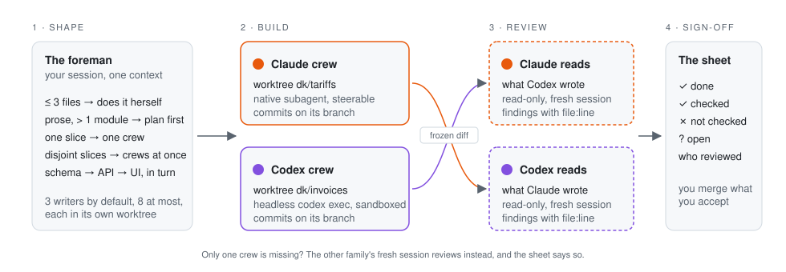

<div align="center">


# delegate-kit

**Claude writes it. Codex reads it. Or the other way round.**<br>
One session, the subscriptions you already pay for, no API keys.

[](https://github.com/tomastaker/delegate-kit/actions/workflows/ci.yml)
[](LICENSE)
[](https://claude.com/claude-code)
[](https://github.com/openai/codex)
[](https://github.com/pingdotgg/t3code)

[The foreman](#the-foreman) · [Before / after](#before--after) · [Numbers](#numbers) · [How it works](#how-it-works) · [Install](#install) · [Commands](#commands) · [FAQ](#faq)

</div>

---

## The foreman

You know her. Hard hat, clipboard, two crews on speed dial — one from Anthropic, one from OpenAI. She has run sites long enough to hold two rules that never bend.

**Nobody signs off on their own concrete.** The crew that poured it does not inspect it. The other crew does, with the drawings in hand, and the sheet says who looked.

**You don't call a crew to change a light bulb.** Three files and a clear ask, she does it herself. Ten modules and a page of prose, she draws a plan before anyone touches a tool. Two jobs that don't share a wall, two crews at once, each behind its own tape.

delegate-kit puts her in your coding session. Your Claude Code or Codex CLI session becomes the coordinator: it keeps the intent, the plan and the answer. Workers are fresh sessions of either family, started once with a full brief, isolated in git worktrees, and reviewed by the family that did not write the code. The whole thing runs on the two CLIs you already have installed and logged in.

## Before / after

You type the same sentence either way:

> change the tariff logic in the billing module — the rules are in `docs/tariffs.md`

**Without her.** The model reads a bit, edits five files in your working tree, runs whatever tests it remembers, and says *done*. If it spawned helpers, two of them edited the same file. The only review is the author reading its own diff, which finds what it already thought of.

**With her.**

```
shape: PLAN — prose requirements, 2 modules, 11 files
spec  → .scratch/tariffs/spec.md               (you said yes to 6 lines)
plan  → planner, read-only, strongest model    (4 steps, 1 blocking question — asked)
build → implementer on Codex, worktree dk/tariffs, committed
review → Claude, other family, read-only       (2 findings: 1 spec, 1 correctness)
fix   → same implementer, resumed              (both closed, tests re-run)
sheet → done · checked: pnpm test, tsc · not checked: prod migration · reviewed by Claude, single
```

Your tree was never touched. You merge the branch when you agree with the sheet.

The other direction works the same: when Claude implements, Codex reads the diff. When you wrote the diff yourself in the session, she still sends it across the street — a change the coordinator made is `self`, never "independent by default".

## Numbers

The claim is that a second family sees what the first one does not. Two kinds of evidence, both small and both reproducible from this repository.

**Seeded bugs, two reviewers.** Four small changes, each with two defects planted on purpose (an off-by-one, a spec violation, a units mix-up, a substring match where an exact one was required). Each diff went to one Claude reviewer and one Codex reviewer through `agent-run`, same brief, same spec, no hints. Scored by hand against the planted list.

| | Claude reviewer (Opus, high) | Codex reviewer (Sol, high) | Both together |
|---|---|---|---|
| Planted defects caught | **8 of 8** | **8 of 8** | 8 of 8 |
| Real defects found beyond the planted list | 5 | 5 | **7** |
| Wall-clock per review | 1.5–2 min | 2–3 min | in parallel |

On diffs this small, one competent reviewer of either family catches the planted set, so this run does not prove the "shared blind spots" claim; it bounds it. Where the two differed was in the unplanted findings: two came from Claude alone (a wrong error class, an expiry boundary), two from Codex alone (a permissive base64url decoder, sparse-array validation), three from both. A second family costs one more session and buys a longer list. The diffs, briefs, planted list, runner and raw results are in [`bench/seeded-review/`](bench/seeded-review/); `run.sh` repeats the experiment on your own subscriptions.

**Mechanics that hold under load.** The scripts are tested without any model calls, so the numbers are cheap to reproduce: `bash tests/<name>.sh` in `skills/delegate-kit/`.

| Suite | Checks | What it proves |
|---|---|---|
| `caps.sh` | 47 | writer cap, ceiling, flag and env precedence, native locks counted, refusal under `--detach` |
| `route.sh` | 52 | who runs which role; the reviewer is never the author's family when the other CLI exists |
| `gate.sh` | 27 | dangerous commands stop; a worker cannot start workers |
| `inspect.sh` | 13 | a crashed writer's commits and dirty files reach its replacement |
| `delivery.sh` | 25 | completion hooks fire exactly once; `--race 20` runs 20 rounds × 8 processes: 0 duplicates, 0 lost |

## How it works

<picture>
  <source media="(prefers-color-scheme: dark)" srcset="assets/flow-dark.svg">
  
</picture>

**1 · Shape.** Before anything else the coordinator names the shape of the task, from numbers, not mood:

| Shape | When | Who |
|---|---|---|
| **DIRECT** | ≤ ~3 files, clear requirements; explanations; micro-fixes; anything destructive or production-adjacent | the coordinator, in the foreground |
| **SCOUT** | the hard part is *finding*: a large repo, several plausible causes, docs to quote | one read-only worker, then decide again |
| **PLAN** | prose requirements, ambiguity, > 1 module or > ~10 files; any question that ends in a verdict | planner, read-only, strongest model |
| **SINGLE** | one vertical slice too big for DIRECT | one implementer in its own worktree |
| **PARALLEL** | 2+ slices with disjoint write scopes and stable interfaces | one implementer per slice, each in a worktree |
| **SEQUENTIAL** | one result changes the next task's assumptions (schema → API → UI) | one worker at a time, resumed |

Worker count equals the number of independent outcomes. Coupled edits stay in one pair of hands; split, they come back as merge conflicts and two designs.

**2 · Build.** Every writer gets a git worktree with a lock. Native workers (a subagent of your host, same family, steerable) and external workers (a headless `claude -p` / `codex exec` of the other family, launched once, collected once) are named as such and never confused. Three writers run at once by default; the ceiling is eight, and between the two she states the partition and waits for your yes.

**3 · Review.** The author of a non-trivial change does not certify it. Independence has an order of preference, not a hard requirement:

1. **The other family than the author**, whenever its CLI is installed.
2. **A fresh session of the author's family** when it is not — marked `independent: false`, and the sheet says so.

Depth is measured from the diff, and anything beyond one reviewer is proposed with the numbers and run on your yes:

| Depth | Reviewers | When |
|---|---|---|
| `single` | one | small diff, one module, no risk zone — the default |
| `panel` | two, parallel and blind to each other | large diff, several modules, or a risk zone |
| `led` | a lead plans, three review, the lead merges | very large or risky |

Findings go back to whoever can close them: mechanical ones the coordinator fixes, substantive ones return to the same implementer, resumed with its context. A dispute is settled by a command first — a test, a typecheck, a grep — and only then by a verifier.

**4 · Sign-off.** Every worker returns one JSON object: `status`, `changes`, `checks_run`, `not_verified`, `findings`, `questions`. The coordinator's report is built from it: done, checked, not checked, open, which family reviewed at which depth. A check that did not run is reported as not run. A worker's "done" is evidence to inspect, not a verdict.

**Limits she keeps.** Writer cap 3, ceiling 8, total workers = writers + 3, delegation depth 1 — a worker never starts workers, and the safety hook denies it if one tries. When a subscription hits its limit mid-run, the writer is retried once on the other family with a note about the commits the first one left; it continues, it does not start over.

## Install

**Prerequisites.** The policy and native workers need only your host. Workers from the other family need that family's CLI installed and logged in, plus `bash`, `git`, `jq`, `node ≥ 20`.

```bash
npx skills add tomastaker/delegate-kit
```

or by hand:

```bash
git clone https://github.com/tomastaker/delegate-kit ~/dev/delegate-kit
ln -s ~/dev/delegate-kit/skills/delegate-kit ~/.agents/skills/delegate-kit
ln -s ../../.agents/skills/delegate-kit ~/.claude/skills/delegate-kit     # Claude Code
ln -s ../../.agents/skills/delegate-kit ~/.codex/skills/delegate-kit      # Codex CLI
```

Then the native role definitions and the safety hook. The installer backs up your settings and shows the diff first:

```bash
~/.agents/skills/delegate-kit/hooks/install.sh --dry-run
~/.agents/skills/delegate-kit/hooks/install.sh          # --claude / --codex / --hooks-only / --agents-only
```

Optional, for driving the scripts yourself:

```bash
echo 'export PATH="$HOME/.agents/skills/delegate-kit/scripts:$PATH"' >> ~/.zshrc
```

Restart running `claude` / `codex` sessions. The symlinks keep it live: `git pull` is the update; re-run `install.sh` after a change to the roles.

**Hosts.** Claude Code and Codex CLI act as coordinator and as worker. [T3 Code](https://github.com/pingdotgg/t3code) acts as coordinator over either CLI; its workers are the same two families.

**Always on.** The skill triggers on its own words (see [Talking to her](#talking-to-her)). To have it triage every non-trivial task, add one line to your global instructions:

```text
Before repository work described in prose or spanning several modules, apply delegate-kit; a DIRECT verdict needs no announcement.
```

**Uninstall.** `hooks/uninstall.sh`, remove the three symlinks, and `rm -rf ~/.delegate-kit` if you do not want to keep the ledger and run logs.

## Commands

Work as usual; she triggers on her own words. When you want to drive a step by hand, the two scripts are the whole surface. `--help` on either is the flag reference.

| Command | Does |
|---|---|
| `agent-run route --role <role> [--preset P]` | who runs this role, on which family, natively or externally |
| `agent-run route --role reviewer --diff FILE --author-backend claude\|codex\|self` | depth, lenses, family and cost of a review; `self` when you wrote the diff |
| `agent-run run --role <role> --brief FILE [--backend B] [--cwd WORKTREE] [--detach]` | start a worker; `--detach` for parallel writers |
| `agent-run resume <id> --prompt TEXT` | continue a worker with its context (fix findings, answer questions) |
| `agent-run list \| status <id> \| wait <id> \| kill <id> \| log <id>` | the ledger |
| `agent-run inspect [WORKTREE]` | what a stopped writer left: commits since base, dirty files |
| `agent-run preset [auto\|main-claude\|main-codex]` | which family carries the heavy roles; alone, shows the effective table |
| `agent-wt create \| diff \| lock \| release \| remove <task>` | a writer's worktree, its frozen diff, and the lock the cap counts |

A typical hand-driven pass:

```bash
agent-run run --role planner --brief .scratch/tariffs/brief.md
agent-wt create tariffs
agent-run run --role implementer --backend codex --cwd ../repo.worktrees/tariffs --brief .scratch/tariffs/impl.md
agent-wt diff tariffs > .scratch/tariffs/review.diff
agent-run route --role reviewer --diff .scratch/tariffs/review.diff --author-backend codex
agent-run run --role reviewer --backend claude --cwd ../repo.worktrees/tariffs --brief .scratch/tariffs/review.md
agent-run resume <implementer-id> --prompt "Fix findings 1 and 3: ..."
```

<details>
<summary><b>The roles</b></summary>

| Role | Does | Default | Access |
|---|---|---|---|
| **planner** | ordered steps, files per step, risks, blocking questions, the checks that prove completion | Claude Fable high · Codex Sol xhigh | read-only |
| **implementer** | one vertical slice in its own worktree; runs the acceptance checks; commits on its branch | Codex Sol high · Claude Opus high for UI | write, sandboxed |
| **reviewer** | reads the frozen diff against the spec; findings with severity, lens, file:line, evidence, fix | the other family than the author | read-only |
| **review-lead** | plans a `led` review before, merges findings after; two short calls | the planner's family, strongest | read-only |
| **verifier** | settles one disputed or high-risk finding that a command cannot | third party to the reviewer | read-only |
| **researcher** | quotes current docs with URL and date; marks what it could not verify | Claude Sonnet medium · Codex Terra medium | read-only, web |

Presets move planner, implementer and researcher; the reviewer follows the author. Reasoning per role: [`references/roles.md`](skills/delegate-kit/references/roles.md).

</details>

<details>
<summary><b>Layout</b></summary>

```
skills/delegate-kit/
  SKILL.md                      the policy: shape, spec, route, brief, worktree, review, report
  references/hosts.md           native dispatch per host; git with parallel writers
  references/external.md        the other family through agent-run: preflight, collecting, presets, limits
  references/roles.md           families, tiers, reasoning per role, prompt hints
  references/review.md          depth, lenses, panel composition, merge rules, smell baseline
  references/brief-template.md  how to write a brief
  references/result-schema.json the JSON contract
  references/codex-agents.toml  the six roles as native Codex subagents
  agents/dk-*.md                the six roles as native Claude Code subagents
  scripts/agent-run             route / preset / run / resume / list / status / wait / kill / log / notify / inspect
  scripts/agent-wt              create / list / status / diff / lock / release / remove / cleanup
  hooks/gate.sh, install.sh, uninstall.sh
  tests/*.sh                    caps, route, gate, inspect, delivery — synthetic, no model calls
bench/seeded-review/            the planted-defect review experiment: diffs, briefs, runner, results
```

</details>

## Talking to her

| You say | She does |
|---|---|
| "delegate", "subagent", "scout", "plan this", "review this", "second opinion" | picks a shape and says which |
| a feature or refactor described in prose; "which should we adopt?" | PLAN |
| "let Codex implement", "main model Claude", `main-claude` / `main-codex` | moves the heavy roles to that family for this task; the reviewer still follows the author |
| "plan with Fable", "review with Sol" | one model for one role; the preset is untouched |
| "panel", "two reviewers", "led" | your yes to a deeper review, given in advance |
| "this is mechanical" / "a refactor" / "UI work" | `--kind`: always `single` / lenses `correctness`+`standards` / implementer on Claude under `auto` |

**Decides alone:** the shape; family, model, effort and native-vs-external per role; the reviewer; review depth from the diff; a command before a verifier; one cross-vendor retry on a rate limit.

**Stops and asks:** before a panel (with the numbers); before a fourth writer (with the partition); when a worker returns `blocked` with questions; when your working tree is dirty and the task touches it; before any command the safety gate classes as dangerous.

If you interview yourself first (a grill skill, a spec session), save the outcome as `.scratch/<task>/spec.md`. Workers and the reviewer read that file, not a retelling.

## What she won't do

- **Steer an external worker mid-run.** Headless sessions run to completion; you read the result and resume. That is why native is preferred inside the family, and why an external worker is never called a subagent.
- **Run a swarm.** Writer cap 3, ceiling 8, and the ceiling holds against every flag. Between the two it takes a stated partition and your yes.
- **Make delegation cheap.** A worker is a full session. The shapes exist so you pay for one only for independence, parallelism or a clean context.
- **Sandbox by herself.** The gate is a list of dangerous command shapes; the real isolation is the CLIs' own sandboxes plus the worktree.
- **Route other people's subscriptions.** Workers run through the official CLIs with the logins you already have — ordinary use of Claude Code and Codex. Do not wrap this into a product that does otherwise.

## FAQ

**I only have one of the two subscriptions. Is this for me?**
Less so. You still get the shapes, the worktrees, the caps and the report, and review falls back to a fresh session of your own family, honestly labelled. But the reason to install this over a good single-family workflow such as [Superpowers](https://github.com/obra/superpowers) is the second family. Without it, Superpowers is the more mature choice.

**How is this different from Claude Code agent teams?**
Agent teams are Claude talking to Claude: teammates share a task list and message each other. delegate-kit is about the *other* family reading your diff, about one writer per worktree, and about a report that names what was not checked. They are not exclusive; the foreman does not care how a native worker was spawned, only that it stayed behind its tape.

**Why not an API key and a multi-model MCP server?**
Because you already pay for two CLIs with their own sandboxes, rate limits and logins. `claude -p` and `codex exec` are official, headless, and free with the subscription. The price is that an external worker cannot be steered mid-run, which the shapes are designed around.

**What does a worker cost?**
A full session: system prompt, project instructions, the files it reads. Tens of thousands of tokens before it does anything. That is why ≤ 3 files is DIRECT, why effort is raised before model tier, and why the reviewer gets a frozen diff instead of the whole repository.

**What if the other CLI is missing?**
`agent-run route` says so, picks a fresh session of the author's family, marks it `independent: false`, and the report repeats it. Nothing pretends.

**Can a worker start its own workers?**
No. Delegation depth is one. The safety hook denies `agent-run run` and `agent-wt lock` when the caller is a subagent.

**Does it work in T3 Code?**
As coordinator, yes: T3 Code drives Claude Code or Codex, and the skill runs in that session. Workers are still the two CLIs.

**Is it safe to let it run commands?**
The hook (`hooks/gate.sh`) stops the dangerous shapes — deletes, force pushes, secrets, production hosts — and asks you. Writers are confined to a worktree and to the CLI's own sandbox. The gate is a list, not a sandbox; read it before you trust it.

## License and acknowledgments

MIT. The review lenses `spec` and `standards` and the smell baseline are adapted from [mattpocock/skills — code-review](https://github.com/mattpocock/skills/blob/main/skills/engineering/code-review/SKILL.md) (MIT). The host dispatch table and git-coordination facts borrow from [Hyperskills](https://github.com/hyperb1iss/hyperskills); one worker per independent outcome from [Superpowers](https://github.com/obra/superpowers). The README voice owes a debt to [ponytail](https://github.com/DietrichGebert/ponytail).
